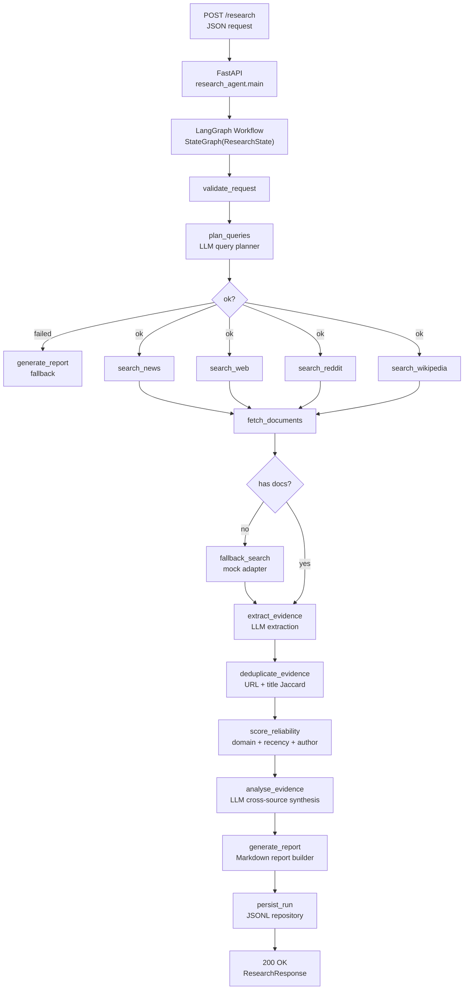

# Pocket Powered Analyser

_A graph-based agentic research platform for source-aware evidence collection and synthesis._

---

## What it does

Pocket Powered Analyser transforms a free-form research question into a structured, sourced research report. It runs a multi-stage LangGraph pipeline that plans source-specific queries, fans out searches across news, web, Reddit, Wikipedia, and social media, fetches full document content, extracts structured evidence via LLM, deduplicates and reliability-scores results, synthesises findings across sources, and produces a professional Markdown report.

```
User question
  → query planning (LLM)
  → parallel source search (news, web, Reddit, Wikipedia, social)
  → document fetch
  → evidence extraction (LLM)
  → deduplication & reliability scoring
  → cross-source synthesis (LLM)
  → structured research report
```

This is a staff-engineering-grade internal platform, not a notebook demo. Every external call has timeouts, retries, structured errors, and tests. Partial failures are surfaced explicitly in the output. Mock adapters are built in so the full pipeline works without any API keys.

---

## Architecture



### State graph

A single `ResearchState` (Pydantic model) flows through every node. LangGraph's `MemorySaver` checkpoints after each step, enabling resumability and debugging.

### Source adapters

All adapters implement `BaseSearchAdapter` with `search()` and `fetch()`. When no real API key is configured, the corresponding mock adapter is used automatically — the pipeline never breaks.

| Adapter | Real backend | Mock adapter | Source type |
|---|---|---|---|
| `NewsSearchAdapter` | Bing News API | `MockNewsAdapter` | news |
| `WebSearchAdapter` | Tavily API / trafilatura | `MockWebAdapter` | web |
| `RedditSearchAdapter` | Reddit OAuth API | `MockRedditAdapter` | reddit |
| `SocialSearchAdapter` | HN Algolia API | `MockSocialAdapter` | social |
| `WikipediaSearchAdapter` | MediaWiki API | `MockWikipediaAdapter` | wikipedia |

### Key design decisions

- **Structured LLM output** via Pydantic response models. Providers that support native tool-calling (OpenAI, Anthropic, Google) get validated objects directly; Ollama falls back to prompt-based JSON parsing.
- **Reliability scoring** combines source-type weight (news 0.6 → social 0.1), domain reputation bonus, author presence, recency penalty, and claim confidence.
- **Deduplication** uses canonical URL matching first, then Jaccard title similarity (threshold 0.8).
- **Auth errors** (401/403) fail fast instead of wasting retries.
- **All failures surface** in the report's warnings section — nothing is silently hidden.

---

## Quick start

### Prerequisites

- Python 3.12+
- [uv](https://docs.astral.sh/uv/) (recommended) or pip
- (optional) [Ollama](https://ollama.com) for local LLM inference
- (optional) API keys for real search backends (see configuration)

### Clone and install

```bash
git clone git@github.com:uncle-voh-max/pocket-powered-analyser.git
cd pocket-powered-analyser

cp .env.example .env
# Edit .env to set your preferred LLM provider and any API keys
```

```bash
# With uv
uv sync --extra dev

# Or with pip
pip install -e ".[dev]"
```

### Run the CLI

```bash
uv run python -m research_agent.cli run "What is the impact of AI safety research?"
```

Use the `--output` flag to save the report to a file:

```bash
uv run python -m research_agent.cli run "How does CRISPR gene editing work?" --output report.md
```

### Run the API server

```bash
uv run uvicorn research_agent.main:app --host 0.0.0.0 --port 8000 --reload
```

```bash
curl -X POST http://localhost:8000/research \
  -H "Content-Type: application/json" \
  -d '{
    "question": "What is the impact of AI safety research?",
    "max_results_per_source": 2,
    "include_sources": ["news", "web", "wikipedia"]
  }'
```

Other endpoints:

```bash
# Health check
curl http://localhost:8000/health

# Prometheus metrics
curl http://localhost:8000/metrics

# Retrieve a completed run
curl http://localhost:8000/research/run_20250101_120000
```

### Using the Jupyter notebook

```bash
jupyter notebook notebooks/run_research.ipynb
```

The notebook walks through the pipeline step by step and supports batch runs over multiple questions.

---

## Running with Ollama (local LLM)

No API keys or cloud services required. Ollama runs on your machine and serves models locally.

### 1. Install and start Ollama

```bash
# macOS
brew install ollama

# or download from https://ollama.com

# Start Ollama (it runs as a background service on macOS by default)
ollama serve
```

### 2. Pull a model

```bash
ollama pull phi4-mini:latest
```

### 3. Configure `.env`

```bash
LLM_PROVIDER=ollama
OLLAMA_BASE_URL=http://localhost:11434
OLLAMA_MODEL=phi4-mini:latest
```

The default `OLLAMA_BASE_URL` points to `http://host.docker.internal:11434` (for devcontainer use), so when running locally you must set it to `http://localhost:11434`.

### 4. Verify the connection

```bash
uv run python -c "
from langchain_ollama import ChatOllama
from langchain_core.messages import HumanMessage

llm = ChatOllama(model='phi4-mini:latest', base_url='http://localhost:11434')
resp = llm.invoke([HumanMessage(content='say hi in one word')])
print(resp.content)
"
```

### 5. Run the pipeline

```bash
# CLI
uv run python -m research_agent.cli run "What is the impact of AI safety research?"

# Or API server
uv run uvicorn research_agent.main:app --host 0.0.0.0 --port 8000
curl -X POST http://localhost:8000/research \
  -H "Content-Type: application/json" \
  -d '{"question": "How does CRISPR gene editing work?"}'
```

### Running Ollama from a devcontainer

When the app runs inside a VS Code devcontainer, use `host.docker.internal` to reach Ollama on the host:

```bash
# On the host, start Ollama with origin restrictions disabled (Docker IPs are not localhost):
OLLAMA_ORIGINS=* ollama serve
```

```bash
# Inside the container's .env:
OLLAMA_BASE_URL=http://host.docker.internal:11434
OLLAMA_MODEL=phi4-mini:latest
```

---

## Configuration

All configuration is via environment variables or a `.env` file (copy from `.env.example`). The `Settings` class in `src/research_agent/config.py` documents every option.

### LLM provider

| Variable | Default | Description |
|---|---|---|
| `LLM_PROVIDER` | `openai` | `openai` or `ollama` |
| `LLM_MODEL` | `gpt-4o-mini` | Model name for OpenAI |
| `OPENAI_API_KEY` | — | Required when `LLM_PROVIDER=openai` |
| `OPENAI_BASE_URL` | — | Custom OpenAI-compatible endpoint |
| `OLLAMA_BASE_URL` | `http://host.docker.internal:11434` | Ollama server URL |
| `OLLAMA_MODEL` | `deepseek-v4-flash:cloud` | Model name for Ollama |

### Search backends (all optional)

| Variable | Backend |
|---|---|
| `BING_NEWS_API_KEY` | Bing News Search |
| `TAVILY_API_KEY` | Tavily web search |
| `SERPAPI_API_KEY` | SerpAPI web search |
| `REDDIT_CLIENT_ID` / `REDDIT_CLIENT_SECRET` | Reddit OAuth |

When no key is set, the corresponding source uses a mock adapter that returns synthetic data — the pipeline still runs end to end.

---

## Docker

### Docker Compose

```bash
docker compose up --build
```

The API is available at `http://localhost:8000`. Source code is mounted read-only for hot-reload. Data is persisted in `./data/`.

### VS Code devcontainer

1. Open the repo in VS Code.
2. Cmd+Shift+P → **Dev Containers: Rebuild and Reopen in Container**.
3. The devcontainer uses `mcr.microsoft.com/devcontainers/python:3.12` with all dependencies pre-installed.

Inside the devcontainer, use `host.docker.internal:11434` to reach Ollama running on the host:

```bash
# On the host, start Ollama with origin protection disabled:
OLLAMA_ORIGINS=* ollama serve
```

In `.env` inside the container:
```
OLLAMA_BASE_URL=http://host.docker.internal:11434
OLLAMA_MODEL=llama3.2
```

> The devcontainer forwards ports 8000 (API), 8888 (Jupyter), and 11434 (Ollama).

---

## Testing

```bash
# Run all tests (fast — skips slow LLM-dependent nodes via automatic mocking)
uv run pytest -v

# Run only unit tests
uv run pytest -v -m "not integration"

# Run with coverage
uv run pytest -v --cov=research_agent

# Run slow tests that require external services
uv run pytest -v -m "slow"
```

LLM-dependent nodes are automatically mocked during tests via a `conftest.py` fixture that makes `llm_call` fail instantly, exercising the built-in fallback code paths. All 40+ tests complete in under two seconds without any external services.

---

## Project structure

```
src/research_agent/
├── __init__.py
├── main.py              # FastAPI application
├── cli.py               # Typer CLI
├── config.py            # Pydantic Settings
├── logging.py           # Structured logging (structlog)
├── observability/       # Prometheus metrics, OpenTelemetry
│
├── adapters/            # Source adapters (BaseSearchAdapter)
│   ├── base.py
│   ├── news.py          # Bing News
│   ├── web.py           # Tavily / trafilatura
│   ├── reddit.py        # Reddit OAuth
│   ├── social.py        # Hacker News Algolia
│   ├── wikipedia.py     # MediaWiki
│   └── mock.py          # Mock data for all sources
│
├── graph/               # LangGraph workflow
│   ├── state.py         # ResearchState (Pydantic)
│   ├── nodes.py         # All pipeline nodes
│   ├── edges.py         # Conditional routing
│   └── workflow.py      # Graph assembly
│
├── planning/            # Query planning
│   ├── query_planner.py # LLM-based plan generation
│   └── prompts.py
│
├── extraction/          # Evidence extraction
│   ├── extractor.py     # LLM extraction per document
│   ├── chunking.py      # Text chunking
│   └── prompts.py
│
├── analysis/
│   ├── dedupe.py        # URL + title dedup
│   ├── reliability.py   # Source reliability scoring
│   ├── analyser.py      # Cross-source LLM synthesis
│   └── synthesis.py     # SynthesisResult model
│
├── report/
│   ├── markdown.py      # Markdown report builder
│   └── json.py          # JSON report builder
│
└── storage/
    ├── repository.py    # ABC for repositories
    └── jsonl_repository.py  # JSONL backend
```

---

## Extending

- **New source adapter**: implement `BaseSearchAdapter`, register in `adapters/__init__` and `graph/nodes.py:_get_adapter()`, add a graph node + edge.
- **New LLM provider**: add a case in `config.py` `LlmProvider` enum, extend `_get_model()` in `llm/client.py`.
- **New storage backend**: implement `Repository` ABC from `storage/repository.py`.
- **New report format**: add a module in `report/`, call from `generate_report_node`.

See `docs/architecture.md` for the full extension guide.

---

## Contributing

See [CONTRIBUTING.md](CONTRIBUTING.md) for pull request guidelines, coding standards, and instructions for adding new source adapters.

## License

MIT — see [LICENSE](LICENSE). Open for contributions, forks, and use.
