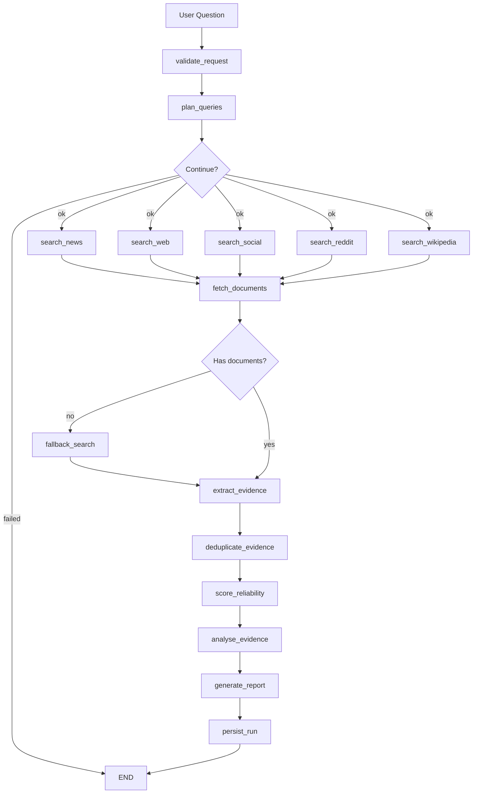

# Architecture

## Overview

Research Agent is a graph-based, agentic information-gathering and research platform. It takes a user's natural language question, plans a multi-source search strategy, gathers evidence from diverse sources, extracts structured evidence, performs cross-source analysis, and generates a professional research report.

## Graph State

The system uses a single `ResearchState` Pydantic model that flows through the entire graph:

```
ResearchState
├── question: str                    # Input question
├── max_results_per_source: int
├── include_sources: list[str]
├── time_window_days: int
├── query_plan: QueryPlan | None     # Planner output
├── raw_search_results: dict         # Adapter outputs
├── raw_documents: list[RawDocument] # Fetched content
├── extracted_evidence: list[ExtractedEvidence]
├── synthesis: SynthesisResult | None
├── report_markdown: str
├── run_id: str
├── status: str
├── errors: list[str]
└── warnings: list[str]
```

The state is checkpointed by LangGraph's `MemorySaver` after each node, enabling resumability and debugging.

## Node Responsibilities

### validate_request
Validates the input question is non-empty. Sets `run_id` and initial `status`.

### plan_queries
Calls the LLM-powered query planner to produce a `QueryPlan` with source-specific search queries, time sensitivity, entities, and success criteria. Falls back gracefully if the LLM call fails.

### search_news / search_web / search_social / search_reddit / search_wikipedia
Parallel fan-out nodes, each using a source-specific adapter to search using the queries from the plan. Real adapters use configured API keys; mock adapters return synthetic data when real keys are absent.

### fetch_documents
Iterates all search results, fetches the full document content via each adapter's `fetch()` method, and collects `RawDocument` objects.

### extract_evidence
For each raw document, calls an LLM extraction agent that produces structured `ExtractedEvidence` including claims, key points, sentiment, and limitations.

### deduplicate_evidence
Removes duplicate evidence by canonical URL, near-identical title, and syndicated content.

### score_reliability
Calculates a 0-1 reliability score for each evidence item based on source type, domain reputation, author presence, recency, and claim confidence.

### analyse_evidence
Performs cross-source analysis: identifies major themes, corroborated claims, contradictions, well/weakly supported conclusions, and research gaps.

### generate_report
Produces a professional Markdown research report with executive summary, evidence table, reliability notes, per-source summaries, and recommendations.

### persist_run
Saves the completed run to a JSONL repository for later retrieval.

### fallback_search
Recovery node that uses mock adapters when real adapters produce no results.

## Source Adapters

All adapters implement `BaseSearchAdapter`:

```
BaseSearchAdapter
├── search(plan: SearchPlan) -> list[RawSearchResult]
├── fetch(result: RawSearchResult) -> RawDocument
└── search_for_query(query: str) -> list[RawSearchResult]
```

| Adapter | Real Backend | Mock | Source Type |
|---------|-------------|------|-------------|
| NewsSearchAdapter | Bing News API | MockNewsAdapter | news |
| WebSearchAdapter | Tavily API | MockWebAdapter | web |
| RedditSearchAdapter | Reddit OAuth API | MockRedditAdapter | reddit |
| SocialSearchAdapter | Hacker News Algolia | MockSocialAdapter | social |
| WikipediaSearchAdapter | MediaWiki API | MockWikipediaAdapter | wikipedia |

## Reliability Scoring

Reliability considers:
- **Source type weight**: news (0.6) > web (0.5) > wikipedia (0.4) > reddit (0.15) > social (0.1)
- **Domain reputation bonus**: +0.25 for high-reputation domains (reuters.com, nature.com, .gov, .edu), +0.1 for medium-reputation
- **Author presence**: +0.05 if author is identified
- **Recency penalty**: -0.15 for content >2 years old, -0.05 for >1 year
- **Claim confidence**: weighted average with source type for final score
- **Sentiment adjustment**: -0.05 for opinion-heavy content in news/web

## Deduplication Strategy

1. **URL canonicalisation**: lowercase scheme+host, remove default ports, strip tracking params
2. **Exact URL dedupe**: same canonical URL → dedupe
3. **Title similarity**: Jaccard similarity >0.8 → dedupe
4. **Source grouping**: by domain/platform for aggregate analysis
5. **Claim-level dedupe**: via content hash (future: embedding-based)

## Failure Handling

- **API quota exhaustion**: returns empty results → recovery to mock adapter
- **HTTP timeout/errors**: returns partial document with error status
- **LLM structured output failure**: retries up to 3 times with exponential backoff
- **Empty search results**: fallback to mock adapter
- **Partial graph completion**: status marked as "partial", warnings collected
- **All failures reported** in final report warnings section

## Observability

- **Structured logging** via structlog with run_id context
- **Prometheus metrics**:
  - `research_runs_total{status}`
  - `research_run_duration_seconds`
  - `source_search_duration_seconds{source}`
  - `source_search_failures_total{source}`
  - `llm_calls_total{operation}`
  - `llm_failures_total{operation}`
- **OpenTelemetry tracing** with console span exporter

## Data Flow (Mermaid)



## Adding a New Source Adapter

1. Create `src/research_agent/adapters/<source>.py`
2. Implement `BaseSearchAdapter` with `search_for_query` and `fetch`
3. Register in `_get_adapter()` in `graph/nodes.py`
4. Add a graph node in `graph/nodes.py` and `graph/workflow.py`
5. Add mock data in `adapters/mock.py`
6. Write tests in `tests/unit/test_adapters.py`

## Extension Points

- **New source adapters**: implement `BaseSearchAdapter`
- **New LLM providers**: configure via `LLM_MODEL` and `LLM_PROVIDER` env vars
- **New storage backends**: implement `Repository` ABC
- **New report formats**: add module in `report/`, call from report generation
- **Semantic deduplication**: add embedding model in `analysis/dedupe.py`
- **Postgres/pgvector**: extend `storage/sqlite_repository.py` or create new backend
